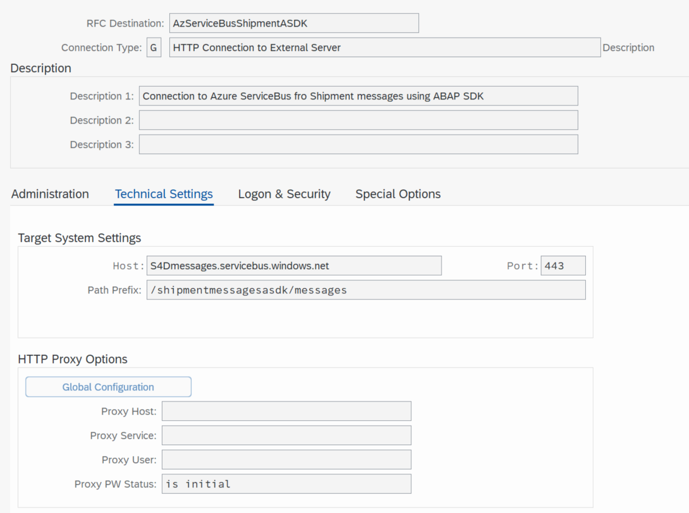
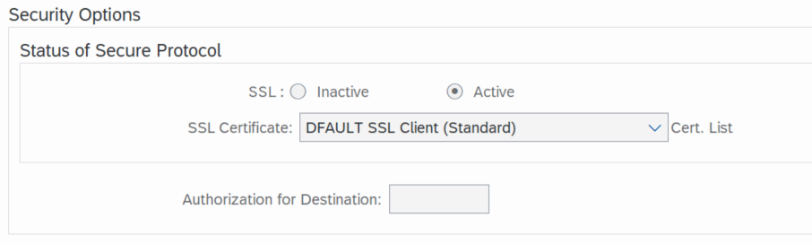
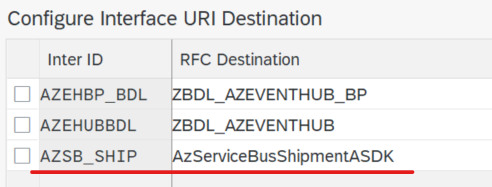
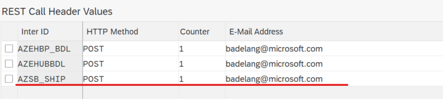
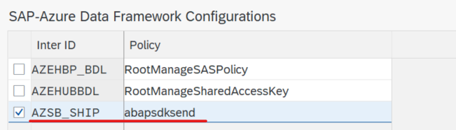
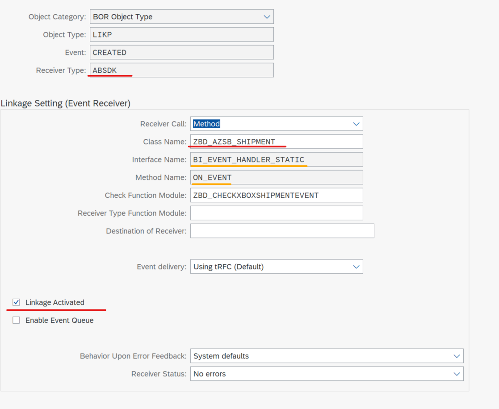
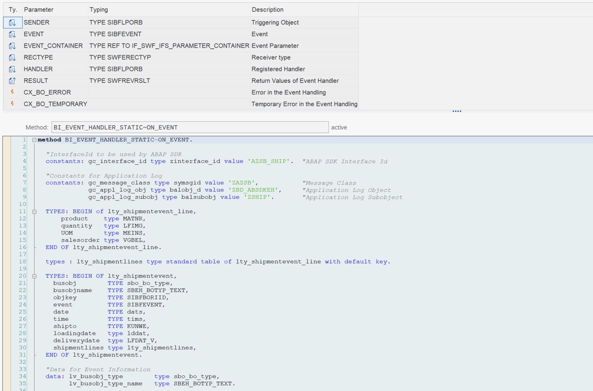
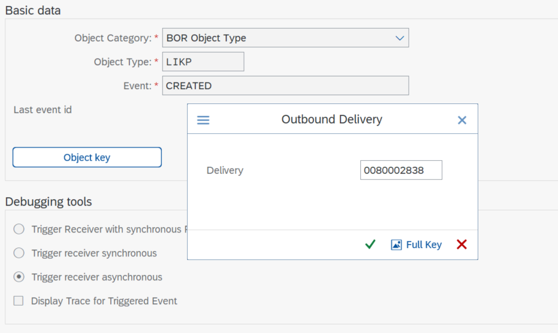
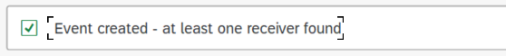
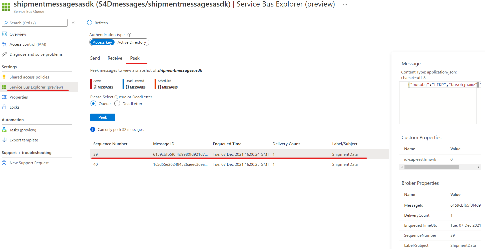

# Cosnume SAP Events using SAP SDK

In this section we'll use the ABAP SDK for Azure to send SAP Events towards a Azure Service bus. Ub our example we want to send messages upon the `create`, `change` or `delete` event of a SAP Delivery.
More information on the `ABAP SDK for Azure` can be found at [microsoft/ABAP-SDK-for-Azure](https://github.com/Microsoft/ABAP-SDK-for-Azure).

## Prerequisites
You can easily install ABAP SDK for Azure in your landscape through [abapGit](https://abapgit.org/). The instructions can be found in Github at [ABAP SDK Installation](https://github.com/microsoft/ABAP-SDK-for-Azure/blob/master/ABAP%20SDK%20for%20Azure%20-%20Github.md#heading--1-7).

>Note: : `abapGit` is mandatory to install `ABAP SDK for Azure`. If you do not already have it in your SAP system, please install it. The instructions can be found in Github at [ABAP SDK Installation](https://github.com/microsoft/ABAP-SDK-for-Azure/blob/master/ABAP%20SDK%20for%20Azure%20-%20Github.md#heading--1-7).

## SAP Setup for ABAP SDK
### RFC Destination
First we need to create a RFC Destination pointing towards our Azure Service Bus Queue. We need our `Queue URL`for this. This url needs to be split into `Host` and `Path Prefix`.
Use transaction `SM59 - Configuration of RFC Connections`. RFC Connection type `G - HTTP Connection to External Server`.



You'll also need to enable SSL. For this you need to upload the certificate chain linked to the `Queue URL` in transaction `STRUST - Trust Manager`.



You can do a connection test. This will result in a pop-up request a user-id and password to logon (or a `401 - Unauthorized error`), since the `SAS Policy` required by the Azure Service Bus is missing. We need to enter this in the ABAP SDK customising tables.

### ABAP SDK Setup
Use transaction `SM30 - Table Maintenance` to create entries in the following ABAP SDK tables.

#### ZREST_CONFIG
`ZREST_CONFIG` is the master table, where you define the InterfaceId for each connection to an Azure object. There is a 1:1 link with the RFC Destination.



#### ZREST_CONF_MISC
`ZREST_CONF_MISC` contains information concerning alerting and re-processing in case of failed messages.



>Note: Retry Frequency is `Regular`.

#### ZADF_CONFIG - SAP Azure Date Frame Configuration
`ZADF_CONFIG` contains information specific to the Azure Object. In our case it contains the `SAS Primary key` needed to connect to the Azure Service Bus Queue.
Use Interface Type = `Azure Service Bus`.

>Note: Call Type was set to `Synchronous Call` and `Reprocess`was set to `Enable Reprocessing`.
<!-- ToDo : isn't asynchronous better? -->

### ZADF_EHUB_POLICY - SAP Azure Data Framework Configurations
`ZADF_CONFIG` contains information specific to the Azure Object. In our case it contains the `SAS Policy Name` needed to connect to the Azure Service Bus Queue.



## SAP EventFramework
The ABAP SDK is now set up. The next step is to hook the ABAP SDK into the SAP Workflow Event Framework. This is primarily done using a `Workflow Event Type Linkage`. Such a linkage binds a Business Object Event and a receiver type together. Such a receiver type could be a `Workflow`, `Function Module` or `Object Method`. In our case we're going to link it with a `Method`of a custom ABAP Object. The API defines that this Object needs to implement the `BI_EVENT_HANDLER_STATIC' Interface. The `On_EVENT` method of this interface needs to be implemented.



> Note : The receiver type can be freely chosen.

### Event Handler Class Setup
The Handling class was defined using `SE24 - Class Builder`. Note the reference to the `BI_EVENT_HANDLER_STATIC` Interface.
We now implement the `ON_EVENT` method as required by the Interface.



This method will : 
1. Gather the required delivery information to be send in the message
1. Generate the JSON Message
1. Send the JSON Message to the Azure Service Bus Queue using the ABAP SDK

#### Gather the required delivery information
Here I read directly from the Delivery tables, but one could as well call a BAPI to get the Delivery Details. The Id of the shipment can be found the ´SENDER´ object.

```
  ...
  "Select delivery related information
  delivery_id = sender-instid.
  select single * from LIKP into delivery_header where VBELN = delivery_id.
  if sy-subrc ne 0.
    "Something went wrong
    ls_msg-msgty  = 'E'.
    ls_msg-msgid  = gc_message_class.
    ls_msg-msgno  = '000'.
    ls_msg-msgv1  = delivery_id.
    APPEND ls_msg TO lt_msg.
    CALL METHOD cl_beh_application_log=>create
       EXPORTING
         i_msg       = lt_msg
         i_object    = gc_appl_log_obj
         i_subobject = gc_appl_log_subobj.
    exit.
  endif.
  lv_shipmentevent-shipto = delivery_header-KUNNR.
  lv_shipmentevent-deliverydate = delivery_header-LFDAT.
  lv_shipmentevent-loadingdate = delivery_header-LDDAT.

  "Select delivery item information
  select * from LIPS into delivery_item where VBELN = delivery_id.
    lv_shipmentline-product = delivery_item-MATNR.
    lv_shipmentline-quantity = delivery_item-LFIMG.
    lv_shipmentline-UOM = delivery_item-MEINS.
    lv_shipmentline-salesorder = delivery_item-VGBEL.
    append lv_shipmentline to lv_shipmentlines.
  endselect.

  move-corresponding lv_shipmentlines to lv_shipmentevent-shipmentlines.
  ...
```
The results are put within a structure which 'represents' the json message we want to send out.

#### Convert to JSON
Here I'm using the `/ui2/cl_json=>serialize` which provides a convenient method to convert an ABAP structure into json.

```
    ...
    "Convert to JSON
    gv_json_output = /ui2/cl_json=>serialize( data     = lv_shipmentevent
                                            compress = abap_true
                                            pretty_name = /ui2/cl_json=>pretty_mode-camel_case ).
    ...
```

#### Send to Azure Service Bus
First we need to create a `Service Bus` object by using a factory method
```
    ...
   "Calling Factory method to instantiate service bus client
    oref = zcl_adf_service_factory=>create( iv_interface_id        = gc_interface_id
                                            iv_business_identifier = filter ).
    oref_servicebus ?= oref. "Type Cast to service bus Object?
    ...
```
Sending out the json xstring happens using the `send` method of this object.

```
    ...
    "Sending Converted SAP data to Azure Service Bus
    oref_servicebus->send( EXPORTING request        = lv_json_xstring   "Input XSTRING of SAP Business data
                                     it_headers     = it_headers        "Header attributes
                           IMPORTING response       = lv_response       "Response from Service Bus
                                     ev_http_status = lv_http_status ). "Status
    ...
```

#### Error handling
Since the call to our method takes place in background, the error handling is done by writing to the application log. The application log object can be defined using `slg0`. The application log can be consulted using `slg1`.
applogobjects.png

```
  "Constants for Application Log
  constants: gc_message_class type symsgid value 'ZAZSB',           "Message Class
             gc_appl_log_obj type balobj_d value 'ZBD_ABSDKEH',     "Application Log Object
             gc_appl_log_subobj type balsubobj value 'ZSHIP'.       "Application Log Subobject
  ...  
  CALL METHOD cl_beh_application_log=>create
       EXPORTING
         i_msg       = lt_msg
         i_object    = gc_appl_log_obj
         i_subobject = gc_appl_log_subobj.
  ...
```

>Note : The complete code can be found at the ABAP Code section under [ZBD_AZSB_SHIPMENT-ON_EVENT](ABAPCode\ZBD_AZSB_SHIPMENT-ON_EVENT.abap).

#### Event Linkage Definition
Now we can define the Event Linkage. This is done in transaction `SWE2 - Event Type Linkages`.

eventlinkages2.png

eventlinkage1.png

Here we need to define a new entry for the Delivery events we want to implement.
Use the following settings :
* Object Category = `BOR Object Type`
* Object Type = `LIKP - Delivery`
* Event = `CREATED`
* Receiver Call = `Method`
* Class Name = name of the class we implemented above
* Linkage Activated = yes

>Note : you can also implement the events `CHANGED`, `DELETED`.

#### Message filtering on SAP side
If you want to filter on which Deliveries get send to the Azure Service bus, then you can implement a check function module. If this function module raises a 'NO_APPROVAL_TO_START' exception then the call to the event handler is cancelled and no message is send out. A example function module can be found at [ZBD_CHECKXBOXSHIPMENTEVENT](ABAPCode\ZBD_CHECKXBOXSHIPMENTEVENT.abap). Since in our example we're only interested deliveries concerning XBOX's, this function module checks the material numbers contained within the delivery and raises the 'NO_APPROVAL_TO_START' exception when no XBOX is found.

```
  ...
  "Select delivery item information
  xbox_found = abap_false.
  select * from LIPS into delivery_item where VBELN = delivery_id.
    if c_xbox = delivery_item-MATNR.
      xbox_found = abap_true.
    endif.
  endselect.
  
  if xbox_found = abap_false.
    raise no_approval_to_start.
  endif.
  ...
```

### Testing
You can now test the setup by either creating a Delivery (transation vl01) or by using the 'SWUE - Create Event' to simulate a Event. 
>Note: when you use the `SWUE` transaction, you still need a delivery ;)



If the event was successfully started, the following appears.



You should now see a message appearing in your Service Bus Queue.
messageinservicebusoverview.png

Use the `Service Bus Explorer` to `Receive`or `Peek` into the message.



The message should look like :

```json
{
    "busobj":"LIKP",
    "busobjname":"Outbound Delivery",
    "objkey":"0080002839",
    "event":"CREATED",
    "date":"2021-12-06",
    "time":"13:26:13",
    "shipto":"USCU_L10",
    "loadingdate":"2021-11-15",
    "deliverydate":"2021-11-16",
    "shipmentlines":[
        {
            "product":"MZ-FG-R100",
            "quantity":5.000,
            "uom":"ST",
            "salesorder":"0000002297"
        }
    ]
}

```

>Note : if the message does not appear in your Queue, then you can have a look at the application log `SLG1` to get some more information on possible errors.