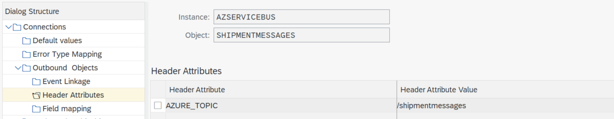

# Consume SAP Events using the ASAPIO Framework

In this section we'll use [Asapio](https://asapio.com/) to send SAP Events towards a Azure Service bus. In our example we want to send messages upon the `create`, `change` or `delete` event of a SAP Delivery.


## Prerequisites
ASAPIO delivers an add-on for Azure Integration. For more information refer to [SAP Data Integration with Microsoft Azure® and ASAPIO](https://asapio.com/azure/). THis add-on is delivered as SAP transports which need to be imported in your SAP system.

## Setup
### RFC Connection
First we need to create a RFC Destination pointing towards our Azure Service Bus Queue.
Use transaction `SM59 - Configuration of RFC Connections`. The RFC Connection type is set to `G - HTTP Connection to External Server`. Here you'll need the queue URL of the Service Bus Queue.


>Note: You only need to provide the hostname of the Service Bus Queue. The specific queue name will be specified in ASAPIO customizing tables later on.
>Note : the SAS policy used will also need to be specified on Service Bus Namespace level. This will allow access to all the queues within the namespace.

You'll also need to enable SSL. For this you need to upload the certificate chain linked to the `Queue URL` in transaction `STRUST - Trust Manager`.


You can do a connection test. This will result in a pop-up request a user-id and password to logon (or a `401 - Unauthorized error`), since the `SAS Policy` required by the Azure Service Bus is missing. We need to enter this in the ASAPIO customizing tables.

### ASAPIO Basic Setup
ASAPIO provides a specif customizing transactions to allow for its setup. These transactions can be accessed from the SAP Customizing (transaction /nSPRO)


We'll be using 'Connection and Replication Object Customizing'.

First we need to define the Azure Service Bus Namespace as a Cloud Instance.
Here we also create the link to the RFC Destination.


For this Cloud Instance we need to provide some 'Default Values'.
Here we specify more information on the receiver. Eg. we indicate the receiver is a Service Bus (`AZURE_SERVICE_TYPE`) and we want to authenticate using a SAS policy (`AZURE_AUTH_TYPE`) and the policy name (`AZURE_KEY_NAME`). We also specify the name of the Service Bus Namespace (`AZURE_NAMESPACE`).


We also need to specify a 'Error Type Mapping'.


In the 'Default Values' we indicated the SAS Policy name. The actual key for this policy we need to provide in the 'Set the cloud connection password' transaction.


Use the Cloud Instance defined in the first step.


This concludes the ASAPIO basic setup for connection to Service Bus. The following sections describes the message specific setup.

### SAP Event Type Linkage Setup for ASAPIO
ASAPIO is making use of a 'Logical Message Type' in the Event Type Linkage. This message type needs to be defined using `WE81 - EDI: Logical Message Type`.


This LogicMessageType needs to be activated using `BD50 - Change Pointers for Message Type`.


This Logical Message type can now be used in the Event Type Linkage.
Use transaction `SWE2 - Event Type Linkage`. Here we use the above defined Message Type as Receiver Type. ASAPIO delivers a predefined function moduke `/ASADEV/ACI_EVENTS_TRIGGER)` to link into their framework.

Use the following settings :
* Object Category = `BOR Object Type`
* Object Type = `LIKP - Delivery`
* Event = `CREATED`
* Receiver Type = your message type
* Receiver Call = `Function Module`
* Receiver Function Module = `/ASADEV/ACI_EVENTS_TRIGGER`
* Load Type = `Incremental Load`
* Linkage Activated = yes


>Note : you can also implement the events `CHANGED`, `DELETED`.

#### Message filtering on SAP side
If you want to filter which Deliveries are sent to the Azure Service bus, then you can implement a check function module. If this function module raises a 'NO_APPROVAL_TO_START' exception then the call to the event handler is cancelled and no message is send out. A example function module can be found at [ZBD_CHECKXBOXSHIPMENTEVENT](ABAPCode\ZBD_CHECKXBOXSHIPMENTEVENT.abap). Since in our example we're only interested deliveries concerning XBOX's, this function module checks the material numbers contained within the delivery and raises the 'NO_APPROVAL_TO_START' exception when no XBOX is found.

```
  ...
  "Select delivery item information
  xbox_found = abap_false.
  select * from LIPS into delivery_item where VBELN = delivery_id.
    if c_xbox = delivery_item-MATNR.
      xbox_found = abap_true.
    endif.
  endselect.
  
  if xbox_found = abap_false.
    raise no_approval_to_start.
  endif.
  ...
```

### ASAPIO Message Setup
Now we can switch back to the ASAPIO customizing to define the message specific setup.
Within our Cloud Instance we now create an Outbound object.

We need the following data :
* Outbound Object can be freely chosen
* Extraction Function Module : function module to select the data and construct the output message
* Message Type : your logical message type, this is also the link towards the Event Type Linkage
* Trace : yes, if you want to the message details within ASAPIO Monitor


We are still missing the Extraction Function Module. Use transaction `SE37 - Function Builder` to create this function module.

#### Extraction Function Module
Since we are creating our own JSON Message format, we need to create our own extraction module. ASAPIO provides predefined Extraction and Formatting function for Event Standards like [Azure Event Grid - Event Schema](https://docs.microsoft.com/en-us/azure/event-grid/event-schema), [CloudEvents](https://cloudevents.io/). Please consult the ASAPIO documentation for more information.

The function needs to adhere to a specific interface to be plugged into the ASAPIO Framework.
```
*"----------------------------------------------------------------------
*"*"Local Interface:
*"  IMPORTING
*"     VALUE(IV_INSTANCE) TYPE  /ASADEV/AMR_ARIBA_ARIBA_INST
*"     VALUE(IV_OBJECT) TYPE  /ASADEV/AMR_ARIBA_ARIBA_OBJECT
*"     VALUE(IT_BDCP_LINES) TYPE  /ASADEV/ACI_TT_BDCP
*"  EXPORTING
*"     VALUE(ET_CSV_LINES) TYPE  /ASADEV/AMR_TT_CSV_LINE
*"     VALUE(ET_RETURN) TYPE  /ASADEV/ACI_TT_BAPIRET2
*"----------------------------------------------------------------------
```
The main steps within the function module are
1. Select the Delivery information.
2. Create the json message
 
##### Select Delivery Information
Since we're only providing some basic information, we can directly read the Delivery tables. When more detail is needed, a BAPI call can always be included.

```
  ...
 "Select delivery related information
  delivery_id = lv_tmp_key.
  select single * from LIKP into delivery_header where VBELN = delivery_id.
  if sy-subrc ne 0.
    "Something went wrong
  endif.
  lv_shipmentevent-shipto = delivery_header-KUNNR.
  lv_shipmentevent-deliverydate = delivery_header-LFDAT.
  lv_shipmentevent-loadingdate = delivery_header-LDDAT.


  "Select delivery item information
  select * from LIPS into delivery_item where VBELN = delivery_id.
    lv_shipmentline-product = delivery_item-MATNR.
    lv_shipmentline-quantity = delivery_item-LFIMG.
    lv_shipmentline-UOM = delivery_item-MEINS.
    lv_shipmentline-salesorder = delivery_item-VGBEL.
    append lv_shipmentline to lv_shipmentlines.
  endselect.
  ...
```
The results are put within a structure which 'represents' the json message we want to send out.

##### Create the json message

```
  ...
  "Convert to json
  gv_json_output = /ui2/cl_json=>serialize( data     = lv_shipmentevent
                                            compress = abap_true
                                            pretty_name = /ui2/cl_json=>pretty_mode-camel_case ).

  "Add json string to output table
  CLEAR ls_csv_line.
  ls_csv_line = gv_json_output.
  APPEND ls_csv_line TO et_csv_lines.
  CLEAR ls_csv_line.
  ...
```
>Note : the actual message sending towards the Service Bus Queue is handled by the ASAPIO framework.

We can now complete the Outbound Object by entering the Extraction Function Module.


If we now select the Event Linkage for our Outbound Object, the above defined Event Linkage for the 'LIKP-Created' event should appear.


We still need to specify the queue where the outbound message needs to be posted. This is done in the Header Attributes of the Outbound Object using the 'AZURE_TOPIC' parameter.



>Note: don't forget the '/' in front of the topic.

## Testing
You can now test the setup by either creating a Delivery (transation vl01) or by using the 'SWUE - Create Event' to simulate a Event. 
>Note: when you use the `SWUE` transaction, you still need a delivery ;)


If the event was successfully started, the following appears.


We can monitor the message sending with transaction `/ASADEV/ACI_MONITOR - ACI Monitor Transaction`. 


Within details you can also see the message contents.


The message should look like :

```json
{
    "busobj":"LIKP",
    "busobjname":"Outbound Delivery",
    "objkey":"0080002839",
    "event":"CREATED",
    "date":"2021-12-06",
    "time":"13:26:13",
    "shipto":"USCU_L10",
    "loadingdate":"2021-11-15",
    "deliverydate":"2021-11-16",
    "shipmentlines":[
        {
            "product":"MZ-FG-R100",
            "quantity":5.000,
            "uom":"ST",
            "salesorder":"0000002297"
        }
    ]
}

```

When the response code is '201 - Created', then the message successfully arrived in the Service Bus Queue.