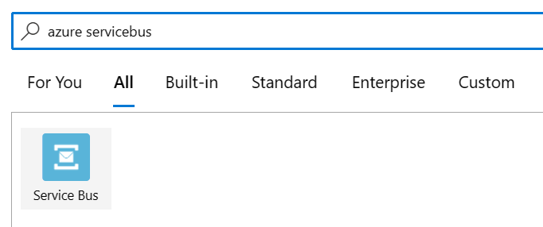
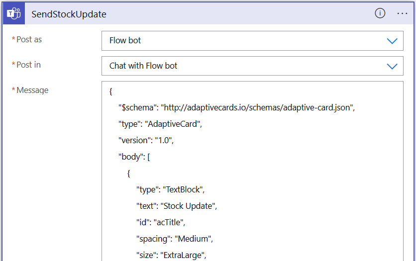

# Create Goods Receipt
The Azure Logic App for the `Create Goods Receipt` scenario looks as follows:


The first component is a Azure Service Bus component and is triggered once a message is received in the topic.\


The Base64 decoding is done by using the `base64ToString()` function in a new *Compose* action which is part of *Data Operations*. The code used is:

```json
"actions": {
    "Base64Decode": {
        "inputs": "@base64ToString(triggerBody()['ContentData'])",
        "runAfter": {},
        "type": "Compose"
    },
```

After the Base64 decoding is done the JSON output will be parsed as a JSON object. The JSON schema is as follows:

```json
{
    "properties": {
        "busobj": {
            "type": "string"
        },
        "busobjname": {
            "type": "string"
        },
        "date": {
            "type": "string"
        },
        "event": {
            "type": "string"
        },
        "goodsmovementlines": {
            "items": {
                "properties": {
                    "availQty": {
                        "type": "integer"
                    },
                    "plant": {
                        "type": "string"
                    },
                    "product": {
                        "type": "string"
                    },
                    "quantity": {
                        "type": "integer"
                    },
                    "storageloc": {
                        "type": "string"
                    },
                    "uom": {
                        "type": "string"
                    }
                },
                "required": [
                    "product",
                    "plant",
                    "storageloc",
                    "quantity",
                    "availQty",
                    "uom"
                ],
                "type": "object"
            },
            "type": "array"
        },
        "objkey": {
            "type": "string"
        },
        "time": {
            "type": "string"
        }
    },
    "type": "object"
}
```

Now it is time to process the goodsmovements lines, we do this in a for-each loop:


## Send a stock update to Teams

The first step is to send a Teams message with an Adaptive Card. In such an Adaptive Card it is possible to add buttons that can be used to trigger follow up actions. In this case that will be the creation of a delivery. The Action used is `Post adaptive card and wait for a response` as part of `Microsoft Teams`.



The adaptive card message used for the demo is as follows:

```json
{
    "$schema": "http://adaptivecards.io/schemas/adaptive-card.json",
    "type": "AdaptiveCard",
    "version": "1.0",
    "body": [
        {
            "type": "TextBlock",
            "text": "Stock Update",
            "id": "acTitle",
            "spacing": "Medium",
            "size": "ExtraLarge",
            "weight": "Bolder"
        },
        {
            "type": "TextBlock",
            "text": "Additional XBox Series X in stock",
            "weight": "Bolder",
            "size": "Medium",
            "spacing": "None",
            "id": "acHeader"
        },
        {
            "type": "TextBlock",
            "text": "We are happy to inform you that there are new items in stock.",
            "id": "acInfo",
            "wrap": true
        },
       {
            "type": "TextBlock",
            "text": "@{items('ForEachGoodsMovement')?['quantity']} items added to the stock, there are now a total of @{items('ForEachGoodsMovement')?['availQty']} items available. Do you now want to create a delivery for your sales order?",
            "wrap": true
       }
    ],
    "actions": [
        {
            "type": "Action.Submit",
            "title": "Create delivery",
            "id": "btnSubmit"
        }
    ]
}
```

The result will look like:


The Logic App will now wait until a response is received. To prevent the Logic App from endlessly waiting a timeout can be set in the setttings of the action. Therefore add a value in the `Duration` field. The value used in the demo is `PT15M` which means that the Logic App will wait for 15 minutes until a timeout is triggered. The format is in ISO 8601.

## Create a delivery in SAP

The next step is to process the response from the Teams message. There are multiple ways to send the creation request to an SAP system. Either via a BAPI call, or by using OData. In case OData is used the service API_OUTBOUND_DELIVERY can be called upon.

This can be either done via an HTTP request directly to SAP and making sure the x-csrf-token is requested before the final call. Or create a Function App taking care of the procedure. In that case the JSON message needs to be send to the Function App. The Action for the Logic App to retrieve the x-csrf-token is:


The SAPURL used is: `https://SAPURL/sap/opu/odata/sap/API_OUTBOUND_DELIVERY_SRV;v=0002/A_OutbDeliveryHeader`

Once the x-csrf-token is successfully retrieved it can be used to create the delivery:


Make a request to the OData service using a JSON message, the values you require might differ:

```json
{
  "to_DeliveryDocumentItem": {
    "results": [
      {
        "ActualDeliveryQuantity": "@{items('ForEachGoodsMovement')?['quantity']}",
        "DeliveryQuantityUnit": "PC",
        "ReferenceSDDocument": "2297",
        "ReferenceSDDocumentItem": "10"
      }
    ]
  }
}
```

Do not forget to set the Cookie value as follows: 

```py
replace(outputs('Retrieve_xcrf_token')['headers']['Set-Cookie'], ',', ';')
```

The standard cookie format returned by the first request is not suffucient to use in the 2nd request. Therefore, make sure to replace the ',' values by ';'.

## Process the response

The last step is to check if the response from SAP was successfull or not, and based on this return a notification to Teams. Make sure to check in the condition for status code `201` and not for `200` as shown in the screenshot. The OData method used in the demo is via a FunctionApp, the result will however be the same.


As successfull response use the action `Post adaptive card in a chat or channel` as part of `Microsoft Teams`. The adaptive card used is:

```json
{
    "$schema": "http://adaptivecards.io/schemas/adaptive-card.json",
    "type": "AdaptiveCard",
    "version": "1.0",
    "body": [
        {
            "type": "TextBlock",
            "text": "Delivery Successfully created",
            "id": "acTitle",
            "spacing": "Medium",
            "size": "ExtraLarge",
            "weight": "Bolder"
        },
        {
            "type": "TextBlock",
            "text": "Delivery created",
            "weight": "Bolder",
            "size": "Medium",
            "spacing": "None",
            "id": "acHeader"
        },
        {
            "type": "TextBlock",
            "text": "Your delivery is created with Delivery ID @{body('CreateDelivery')['DeliveryDocument']}",
            "id": "acInfo",
            "wrap": true
        }
    ]
}
```

The reponse will look like:


For a failed reponse you can use:

```json
{
    "$schema": "http://adaptivecards.io/schemas/adaptive-card.json",
    "type": "AdaptiveCard",
    "version": "1.0",
    "body": [
        {
            "type": "TextBlock",
            "text": "Delivery not created",
            "id": "acTitle",
            "spacing": "Medium",
            "size": "ExtraLarge",
            "weight": "Bolder"
        },
        {
            "type": "TextBlock",
            "text": "Creation failed",
            "weight": "Bolder",
            "size": "Medium",
            "spacing": "None",
            "id": "acHeader"
        },
        {
            "type": "TextBlock",
            "text": "An error occured, the delivery could not be created.",
            "id": "acInfo",
            "wrap": true
        }
    ]
}
```

# Create Delivery

## Send a notification to Teams

A similar structure is used for the Create Delivery notification in Teams as described above.


The Parse JSON schema is:

```json
{
    "properties": {
        "busobj": {
            "type": "string"
        },
        "busobjname": {
            "type": "string"
        },
        "date": {
            "type": "string"
        },
        "deliverydate": {
            "type": "string"
        },
        "event": {
            "type": "string"
        },
        "loadingdate": {
            "type": "string"
        },
        "objkey": {
            "type": "string"
        },
        "shipmentlines": {
            "items": {
                "properties": {
                    "product": {
                        "type": "string"
                    },
                    "quantity": {
                        "type": "integer"
                    },
                    "salesorder": {
                        "type": "string"
                    },
                    "uom": {
                        "type": "string"
                    }
                },
                "required": [
                    "product",
                    "quantity",
                    "uom",
                    "salesorder"
                ],
                "type": "object"
            },
            "type": "array"
        },
        "shipto": {
            "type": "string"
        },
        "time": {
            "type": "string"
        }
    },
    "type": "object"
}
```

Now we have to process the shipment lines.


A for each loop is used and for each shipmentline found post a message into Teams using the following Adaptive Card:

```json
{
    "$schema": "http://adaptivecards.io/schemas/adaptive-card.json",
    "type": "AdaptiveCard",
    "version": "1.0",
    "body": [
        {
            "type": "TextBlock",
            "text": "Your order is on its way to the store",
            "id": "acTitle",
            "spacing": "Medium",
            "size": "ExtraLarge",
            "weight": "Bolder"
        },
        {
            "type": "TextBlock",
            "text": "We are happy to inform you that your XBOX is on it's way to the store",
            "weight": "Bolder",
            "size": "Medium",
            "spacing": "None",
            "id": "acHeader",
            "wrap": true
        },
        {
            "type": "TextBlock",
            "text": "Delivery ID: @{body('ParseShipment')?['objkey']}",
            "id": "acInfoDeliveryID",
            "wrap": true
        },
        {
            "type": "TextBlock",
            "text": "Product: @{items('ForEachShipmentline')?['product']}",
            "id": "acInfoProduct",
            "wrap": true
        },
        {
            "type": "TextBlock",
            "text": "Quantity: @{items('ForEachShipmentline')?['quantity']} @{items('ForEachShipmentline')?['uom']}",
            "id": "acInfoQuantity",
            "wrap": true
        },
        {
            "type": "TextBlock",
            "text": "Salesorder: @{items('ForEachShipmentline')?['salesorder']}",
            "id": "acInfoSalesOrder",
            "wrap": true
        }
    ]
}
```

The result will looke like:


## Send a notification to a mobile device

For the notification to a mobile device the different is that not a Teams message is created but instead a call is done to the FunctionApp.


The Azure Function App is called via the *Azure Functions* component.


After selecting the *Azure Functions* action you can choose the Azure Function App which you created in the earlier step. As *Request Body* provide the outputs of the *ParseShipment* function from the earlier step.