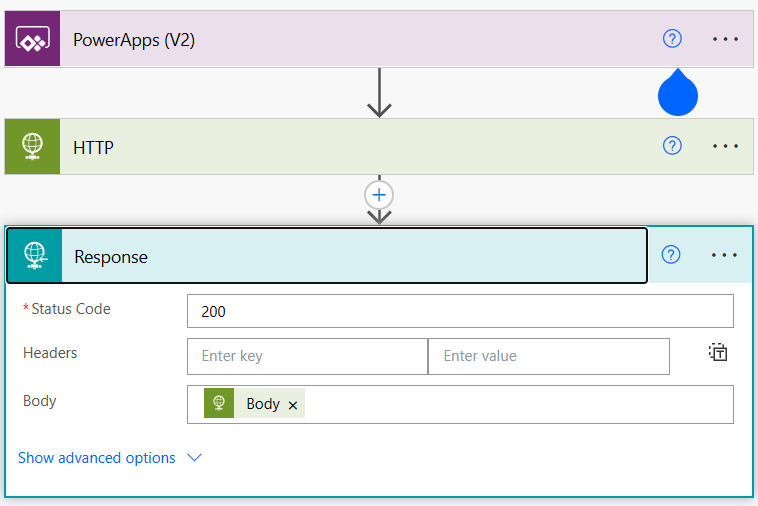
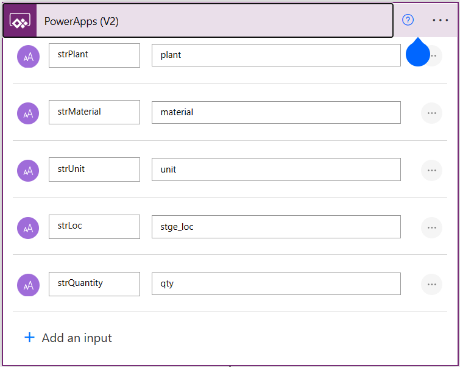
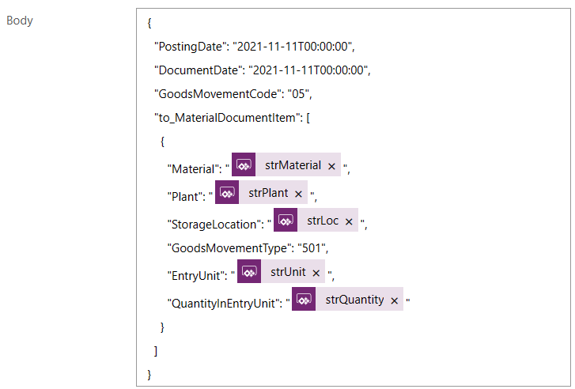
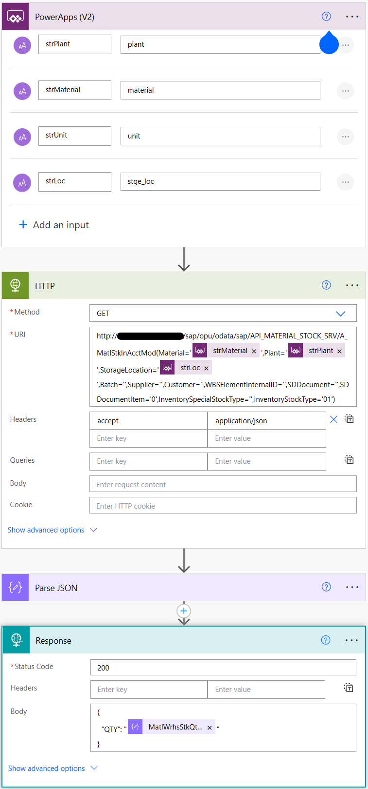

# Create a Power App to create a Goods Receipt

The Power App used in the demo only has two buttons. One to create a goods receipt and one to check the current availability. This is also a way to check if the stock amount is indeed increased.


Both buttons trigger a different Power Automate flow. 

## Create Goods Receipt

The flow for the `Create Goods Receipt` button is triggered by calling:

```javascript
UpdateContext({GoodsReceiptResponse:CreateGoodsReceipt_OData.Run(ddPlant.Selected.Value, ddMaterial.Selected.Value, ddUnit.Selected.Value, ddLoc.Selected.Value, txtQuantity.Text)})
```

The response from the Power Automate flow is saved in the variable `GoodsReceiptResponse` and the Power Automate flow called upon is named `CreateGoodsReceipt_ODATA`. The values shown above the button are send towards the Power Automate flow and are required for the OData call to SAP.

The Power Automate flows looks as follows:



As in the demo a FunctionApp is used for the HTTP call it shows only one call. The same result can be achieved by two HTTP calls, one to retrieve the x-csrf-token from SAP and a 2nd OData call to SAP using this token to POST the JSON. This is described in more detail under the [LogicApps](LogicApps.md) section.

The service URL used for the calls is: `https://SAPURL/sap/opu/odata/sap/API_MATERIAL_DOCUMENT_SRV/A_MaterialDocumentHeader`

The JSON send to SAP is:

```json
{
  "PostingDate": "2021-11-11T00:00:00",
  "DocumentDate": "2021-11-11T00:00:00",
  "GoodsMovementCode": "05",
  "to_MaterialDocumentItem": [
    {
      "Material": "@{triggerBody()['text_1']}",
      "Plant": "@{triggerBody()['text']}",
      "StorageLocation": "@{triggerBody()['text_3']}",
      "GoodsMovementType": "501",
      "EntryUnit": "@{triggerBody()['text_2']}",
      "QuantityInEntryUnit": "@{triggerBody()['text_4']}"
    }
  ]
}
```

In this message some values are hardcoded, this can be modified based on your own scenario. The parameters used come from the Power App:



No worries about the text_# values, in the flow they look more userfriendly and correspond directly to the values defined from the PowerApp:



The response is send back to the PowerApp.

## Get Availability

The flow for the `Get Availability` button is triggered by calling:

```javascript
UpdateContext({MaterialQuantity:GetMaterialAvailability_OData.Run(ddPlant.Selected.Value, ddMaterial.Selected.Value, ddUnit.Selected.Value, ddLoc.Selected.Value).QTY})
```

In this case the `MaterialQuantity` parameter will contain the response from SAP.

The Power Automate flow for the availability looks like:



The schema for the `Parse JSON` function is:

```json
{
    "type": "object",
    "properties": {
        "d": {
            "type": "object",
            "properties": {
                "__metadata": {
                    "type": "object",
                    "properties": {
                        "id": {
                            "type": "string"
                        },
                        "uri": {
                            "type": "string"
                        },
                        "type": {
                            "type": "string"
                        }
                    }
                },
                "Material": {
                    "type": "string"
                },
                "Plant": {
                    "type": "string"
                },
                "StorageLocation": {
                    "type": "string"
                },
                "Batch": {
                    "type": "string"
                },
                "Supplier": {
                    "type": "string"
                },
                "Customer": {
                    "type": "string"
                },
                "WBSElementInternalID": {
                    "type": "string"
                },
                "SDDocument": {
                    "type": "string"
                },
                "SDDocumentItem": {
                    "type": "string"
                },
                "InventorySpecialStockType": {
                    "type": "string"
                },
                "InventoryStockType": {
                    "type": "string"
                },
                "MaterialBaseUnit": {
                    "type": "string"
                },
                "MatlWrhsStkQtyInMatlBaseUnit": {
                    "type": "string"
                },
                "to_MaterialStock": {
                    "type": "object",
                    "properties": {
                        "__deferred": {
                            "type": "object",
                            "properties": {
                                "uri": {
                                    "type": "string"
                                }
                            }
                        }
                    }
                }
            }
        }
    }
}
```

From this response we are only interested in the quantity value and returning this value to the Power App in a JSON format:

```json
{
  "QTY": "@{body('Parse_JSON')?['d']?['MatlWrhsStkQtyInMatlBaseUnit']}"
}
```