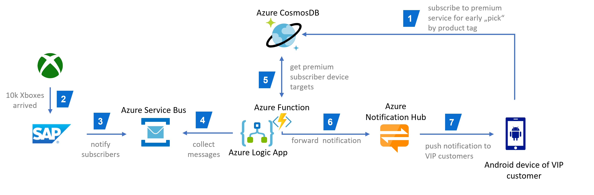
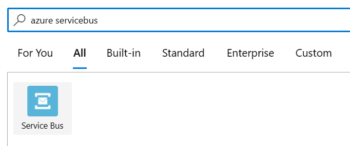
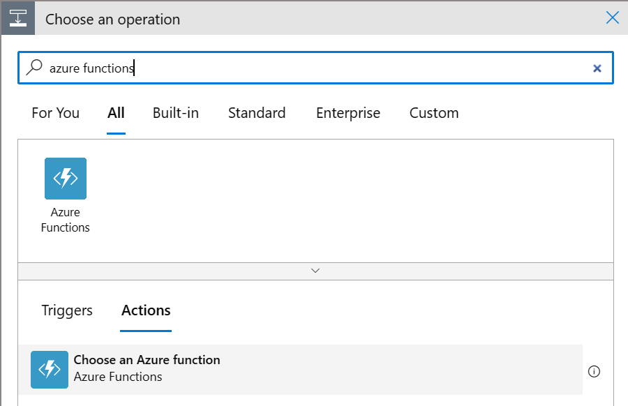

# Xbox shipping scenario using a SAP Event Driven Architecture
## Introduction
This repos contains all the artifacts and descriptions to reproduce our prototype for an event-driven architecture with SAP S/4HANA. See our [blog post](https://blogs.sap.com/2021/12/09/hey-sap-where-is-my-xbox-an-insight-into-capitalizing-on-event-driven-architectures/) for the complete story.

The screenshot and remaining descriptions will be completed over the coming days.

## Setup

The architecture for the solution looks as follows:



### SAP

#### ABAP SDK
See [ABAP SDK](ABAPSDKSetup.md)

#### ASAPIO
Description will follow soon.

### Azure Service Bus
Description will follow soon.

### Azure Notification Hub
The steps to process the SAP message to a notification are described in the [functionApp](https://github.com/thzandvl/xbox-shipping/tree/main/functionApp) section.

### Azure LogicApp

An Azure Logic App is used to read the messages pushed by SAP into the Azure Service Bus from the queue. The messages are pushed in an Base64 format to prevent conflicts. Therefore the message needs to be decoded before it can be used. The format of the message is in JSON. This JSON message is send to the Azure Function App which is based on an HTTP trigger template.
The Azure Logic App look as follows: \


The first component is a Azure Service Bus component and is triggered once a message is received in the queue.\


The Base64 decoding is done by using the `base64ToString()` function in a new *Compose* action which is part of *Data Operations*. The code used is:

```json
"actions": {
    "Base64Decode": {
        "inputs": "@base64ToString(triggerBody()['ContentData'])",
        "runAfter": {},
        "type": "Compose"
    },
```

After the Base64 decoding is done the JSON output can be send to the Azure Function App. The Azure Function App is called via the *Azure Functions* component.



After selecting the *Azure Functions* action you can choose the Azure Function App which you created in the earlier step. As *Request Body* provide the outputs of the *Compose* function from the earlier step.

### Android app
Description will follow soon.