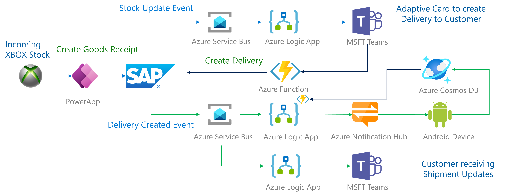

# Xbox shipping scenario using an SAP Event Driven Architecture
## Introduction
This repo contains all the artifacts and descriptions to reproduce our prototype for an event-driven architecture with SAP S/4HANA. See our [blog post](https://blogs.sap.com/2021/12/09/hey-sap-where-is-my-xbox-an-insight-into-capitalizing-on-event-driven-architectures/) for the complete story without the Power Apps and Teams integration.

## Setup

The architecture for the solution looks as follows:

The scenario starts with an event upon creation of a Goods Receipt within SAP using a PowerApp. This event is used to send out a message to an Azure Service Bus topic. Receivers, in our example a Logic App listening to a topic in the Azure Service Bus, will send out notifications to an approver indicating that there is a stock update. \
Based on the stock update the approver will create a delivery. The Delivery Created Event in the SAP system will, just like with the Goods Receipt, send out a message to an Azure Service Bus topic. Two different Logic Apps will read the message based on two different subscriptions belonging to the topic. One will send a notification to a mobile phone and the other will send a notification as a Teams message in Teams.

### Azure Service Bus
Azure Service Bus is a fully managed enterprise message broker with message queues and publish-subscribe topics (in a namespace). For more information, please consult [What is Azure Service Bus](https://docs.microsoft.com/en-us/azure/service-bus-messaging/service-bus-messaging-overview).

The Goods Receipt and Delivery messages will be send to a topic within a Azure Service Bus Namespace. Instruction can be found at [Azure Service Bus setup](ServiceBusSetup.md)
After this step we can turn to the setup on the SAP side.

### SAP Setup
The setup on SAP side mainly consists of :
1. Raise & capture the event when a Goods Receipt and Delivery is created, changed (or deleted)
2. creating the corresponding message
3. send the message to the Azure receiver, in this case this is a Azure Service Bus

To raise the event we will be using `SAP Event Type Linkage`. Since we will be sending out our own message (we're not adhering to standard), we will need custom code to create this json message. For sending the message we used 2 methods. We'll be using the [ABAP SDK for Azure](https://github.com/Microsoft/ABAP-SDK-for-Azure) and [ASAPIO](https://asapio.com/). Both methods will plug into SAP Event Linages on their own way. For ABAP SDK we'll need to create a custom ABAP Class. This class will create the custom message and link to Azure using a class delivered with the ABAP SDK. ASAPIO comes with a predefined function module to hook the ASAPIO framework into the SAP Event Linkage. Both ABAP SDK and ASAPIO depend on customizing tables and a RFC destionation for the connectivity towards Azure.

* ABAP SDK Specific setup can be found [here](ABAPSDKSetup.md)
* ASAPIO specific setup can be found [here](ASAPIOSetup.md)

> **Note**
> At the moment only the procedure for the `Create Delivery` event is described.

### Power Apps

To create a Goods Receipt a Power App is used. This is a great way to show the integration of multiple Azure services with SAP as shown in the architecture. The Power App created is fairly simple and looks as follows:

The steps to create a Power App that interacts with SAP are described [here](PowerApp.md).

### Azure LogicApps

For the demo we use multiple Azure Logic Apps to read the messages pushed by SAP into the Azure Service Bus. The messages are pushed in an Base64 format to prevent conflicts. Therefore the messages needs to be decoded before it can be used. The format of the message is in JSON. To use the JSON easily in the following steps we parse the message to a JSON object. The rest of the steps are dependant on the scenario we are processing.

The detailed description for the Logic Apps created for the different scenario's can be found [here](LogicApps.md).

### Azure Notification Hub
The steps to process the SAP message to an Android notification are described in the [functionApp](https://github.com/thzandvl/xbox-shipping/tree/main/functionApp) section.

### Android app
The steps to use an Android App to receive notifications from the Azure Notification Hub are described in the [androidApp](https://github.com/thzandvl/xbox-shipping/tree/main/androidApp) section.
