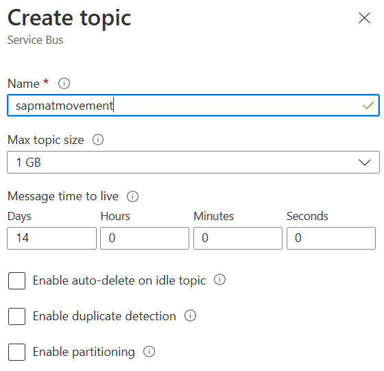
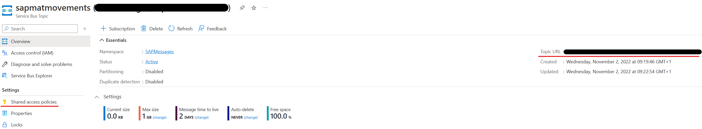

# Azure Service Bus Setup
This setup consists of 2 steps :
1. Create an Azure Service Bus Namespace
2. Create an Azure Service Bus Topic within the Namespace

## Azure Service Bus NameSpace
Search for 'Service Bus' on the Marketplace and press 'Create'.

Provide a resource group, location and name.
The 'Basic' pricing tier is sufficient for our example.

## Azure Service Bus Topic
Now you need to create a topic within your Azure Service Bus Namespace.

To connect the ABAP SDK or ASAPIO to this topic, you'll need the `Topic URL` and a `Shared Access Policy`.
The `Host name`can be found at the Topic Overview Tab.

Here you can also find the link to the `Shared Access Policies (SAS)`. Add a new `SAS Policy` with send permissions. Note the primary key.

