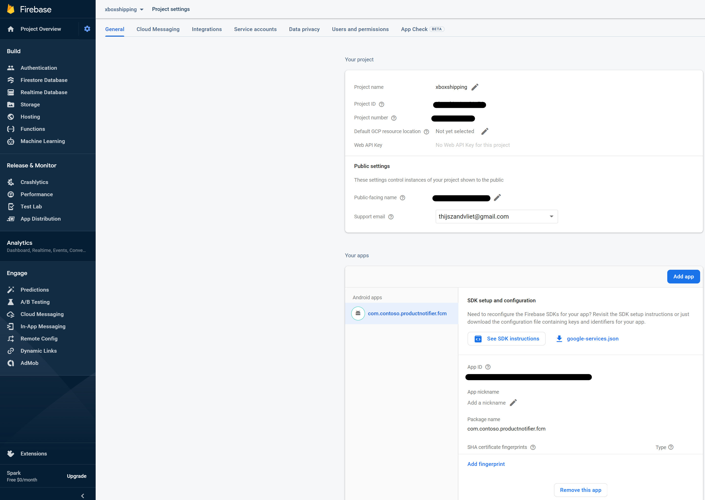
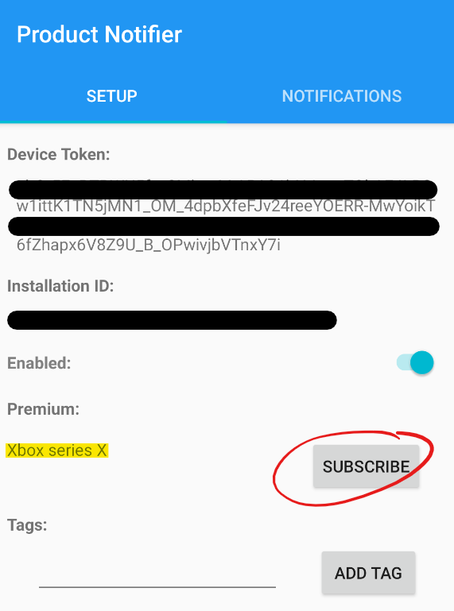

# Receiving the notification

For sending the notification to the Android device we use Azure Notification Hub as shown in the section about the Azure Function App. This service supports multiple platforms. For this demo we used Android as this solution does not involve costs to make it work. The configuration and code will be different per platform. In the case of Android we need to create a Firebase project that supports FCM (Firebase Cloud Messaging).

All the steps to describe the Android setup can be found [here](https://docs.microsoft.com/en-us/azure/notification-hubs/android-sdk). Shortly summarized the following needs to be done.

1. Open the Android Studio project available in this repository
2. Create a Firebase project that supports FCM
3. Connect the Android App to the Azure Notification Hub and CosmosDB
4. Run the app


## Prepare the environment
The Android App used for this demo is based on the demo example from the documentation page. The GitHub with multiple examples can be found [here](https://github.com/Azure/azure-notificationhubs-android) and the code used as the base for this demo can be found [here](https://github.com/Azure/azure-notificationhubs-android/tree/main/notification-hubs-sample-app-java). Easiest for now is to open the androidApp folder as project in [Android Studio](https://go.microsoft.com/fwlink/?LinkId=389797).

### Create a firebase project that supports FCM
Create a new Firebase project on the [Firebase portal](https://console.firebase.google.com/).



The package name used is `com.contoso.productnotifier.fcm`. Once you added the app to the project you will get a `google-services.json` file. Copy this file to the `androidApp\src\fcm` folder.

### Connect the Android App to the Azure Notification Hub and CosmosDB
The credentials are just like with the Function App not part of the code in the repository. Create a new file `secrets.properties` in the `androidApp` folder. This file should look like this:

```
APP_HUB_NAME=xboxshipping-hub
APP_NH_CONNECTION_STRING=Endpoint=sb://xboxshipping-ns.servicebus.windows.net/;SharedAccessKeyName=DefaultListenSharedAccessSignature;SharedAccessKey=<keyvalue>
APP_COSMOS_ENDPOINT=https://xboxshipping.documents.azure.com/
APP_COSMOS_KEY=<CosmosDB key>
```

Replace the `<keyvalue>` and `<CosmosDB key>` by your own values that can be found in your Azure subscription.

## Test the app
Once the `google-services.json` and `secrets.properties` are added to the project the code should work.

## Subscribing to the premium notification service
Before notifications can be received the device token of the Android device should be known in the CosmosDB referred to in the Function App. A new entry is created in the CosmosDB once the subscribe button is used in the Android App.



The button is added to the app from the tutorial and the actions behind it is that a new subscription object is created with the values required for the CosmosDB entry. This object can later be serialized to a JSON object.

### Subscription.java

```java
package com.contoso.productnotifier;

import java.util.Date;
import java.util.UUID;

public class Subscription {

    private String id;
    private String deviceToken;
    private String category;
    private String action;
    private Date createdAt;

    public Subscription() {
        Date date = new Date();
        this.setCreatedAt(date);
        this.id = UUID.randomUUID().toString();
    }

    public void setId(String value) { this.id = value; }

    public String getId() { return this. id; }

    public void setDeviceToken(String value) {
        this.deviceToken = value;
    }

    public String getDeviceToken() {
        return this.deviceToken;
    }

    public void setCategory(String value) {
        this.category = value;
    }

    public String getCategory() {
        return this.category;
    }

    public void setAction(String value) {
        this.action = value;
    }

    public String getAction() {
        return this.action;
    }

    public void setCreatedAt(Date value) { this.createdAt = value; }

}

```

### SetupFragment.java

This code is added to the `SetupFragment.java` file. For the CosmosDB connection the [REST API for CosmosDB](https://docs.microsoft.com/en-us/rest/api/cosmos-db/) is used. Therefore a new Java class is created to process these requests. Volley can be used to build the REST requests. For the connection to the CosmosDB REST API a resourcelink and resourceID are required which are hardcoded in the code. The entry that will be added to the `subscriptions` container is a `docs` object and therefore this is defined in the request.

```java
final Button subscribeButton = root.findViewById(R.id.add_subscription_button);
subscribeButton.setOnClickListener(v -> {
    /* Create a new subscription */
    Subscription subscription = new Subscription();
    subscription.setDeviceToken(deviceTokenValue.getText().toString());
    subscription.setCategory("xbox-series-x");
    subscription.setAction("shipped");

    /* Add the subscription to the Cosmos DB */
    CosmosDB db = new CosmosDB();
    String resourceLink = "dbs/users/colls/subscriptions/docs";
    String resourceId = "dbs/users/colls/subscriptions";
    //String dbResponse = db.getData("GET", "docs", resourceLink, resourceId);
    String dbResponse = db.addSubscription("POST", "docs", resourceLink, resourceId, subscription);

    Toast toast = Toast.makeText(getContext(), dbResponse, Toast.LENGTH_SHORT);
    toast.show();
});
```

### CosmosDB.java

For every REST request an [authorization string](https://docs.microsoft.com/en-us/rest/api/cosmos-db/access-control-on-cosmosdb-resources) needs to be provided. In the documentation multiple examples are shown. The result of the authorization string is very delicate, one mistake will result in a faulty string.

```java
public String generateAuthToken(String verb, String resourceType, String resourceId, String date, String key) {
    byte[] Key = Base64.decode(key.getBytes(StandardCharsets.UTF_8), Base64.DEFAULT);

    /* make sure that the parameters are not null */
    verb = (verb != null) ? verb: "";
    resourceType = (resourceType != null) ? resourceType: "";
    resourceId = (resourceId != null) ? resourceId: "";

    /* construct the payload */
    String payLoad = String.format("%s\n%s\n%s\n%s\n%s\n",
            verb.toLowerCase(),
            resourceType.toLowerCase(),
            resourceId,
            date.toLowerCase(),
            ""
    );

    /* create the signature value */
    String signature = "";
    try {
        Mac mac = Mac.getInstance("HmacSHA256");
        mac.init(new SecretKeySpec(Key, "HmacSHA256"));
        byte[] hashPayLoad = mac.doFinal(payLoad.getBytes(StandardCharsets.UTF_8));

        signature = Base64.encodeToString(hashPayLoad, Base64.DEFAULT);
        Log.i("SIGNATURE", signature);
    } catch (Exception e) {
        Log.e("ERROR", e.toString());
    }
    signature = signature.replace("\n", "");

    /* default values */
    String masterToken = "master";
    String tokenVersion = "1.0";

    /* encode the string to URI format */
    String authToken = "";
    try {
        authToken = URLEncoder.encode(String.format("type=%s&ver=%s&sig=%s",
                masterToken,
                tokenVersion,
                signature), StandardCharsets.UTF_8.toString());
    } catch (Exception e) {
        Log.e("ERROR", e.toString());
    }

    /* return the authorization token */
    return authToken;
}
```

Somehow the signature string added a linebreak at the end of the result, therefore this is removed after the creation.

The `addSubscription` function will first create a date based on the HTTP format, followed by an authorization string based on the input values. After this is done the subscription object is transformed to a JSON string by using Gson. The values are send to a new POST request.

```java
public String addSubscription(String verb, String resourceType, String resourceLink, String resourceId, Subscription subscription) {
    this.resourceLink = resourceLink;

    String date = "";
    String authToken = "";
    try {
        /* get the date in HTTP format */
        date = DateTimeFormatter.ofPattern("EEE, dd MMM yyyy HH:mm:ss z").format(ZonedDateTime.now(ZoneId.of("GMT")));
        Log.i("DATE", date);

        /* generate the authorization token */
        authToken = generateAuthToken(verb, resourceType, resourceId, date, KEY);
        Log.i("AUTHTOKEN", authToken);
    } catch (Exception e) {
        Log.e("ERROR", e.toString());
    }

    /* serialize the subscription object to JSON */
    Gson gson = new Gson();
    String jsonString = gson.toJson(subscription);
    JSONObject jsonBody = new JSONObject();
    try {
        jsonBody = new JSONObject(jsonString);
        Log.i("JSON", jsonBody.toString());
    } catch (Exception e) {
        Log.e("JSON ERROR", e.toString());
    }

    /* build a POST request and return */
    return httpRequestPOST(date, authToken, jsonBody);
}
```

For the POST request Volley is used. Most important for the function are the [header values](https://docs.microsoft.com/en-us/rest/api/cosmos-db/common-cosmosdb-rest-request-headers). The following needs to be defined:

* `Content-Type: application/json`. Not mandatory but good to provide.
* `Authorization: <the authorization string>`. This is a required value.
* `x-ms-version: 2017-02-22`. This is a required value. [Supported REST API Versions](https://docs.microsoft.com/en-us/rest/api/cosmos-db/#supported-rest-api-versions).
* `x-ms-date: Thu, 09 Dec 2021 01:23:45 GMT`. This is a required value. Make sure the date is in the [HTTP format](https://docs.microsoft.com/en-us/rest/api/storageservices/representation-of-date-time-values-in-headers).
* `x-ms-documentdb-partitionkey: ["xbox-series-x"]`. This is a required value. This value needs to refer to the partition key defined in the CosmosDB container. Make sure to use the value between [] and quotes.

```java
public String httpRequestPOST(String date, String authToken, JSONObject jsonBody) {
    JsonObjectRequest jsonObjReq = new JsonObjectRequest(
            Request.Method.POST,
            ENDPOINT + this.resourceLink,
            jsonBody,
            new Response.Listener<JSONObject>() {
                @Override
                public void onResponse(JSONObject response)
                {
                    Log.i("RESPONSE", response.toString());
                }
            },
            new Response.ErrorListener() {
                @Override
                public void onErrorResponse(VolleyError error)
                {
                    Log.e("POST RESPONSE ERROR", error.toString());
                    VolleyLog.e("VOLLEYLOG", error.getMessage());
                }
            }) {
        @Override
        public Map getHeaders() throws AuthFailureError
        {
            /* add headers to the request */
            HashMap headers = new HashMap();
            headers.put("Content-Type", "application/json");
            headers.put("Authorization", authToken);
            headers.put("x-ms-version", "2017-02-22");
            headers.put("x-ms-date", date);
            try {
                headers.put("x-ms-documentdb-partitionkey", "[\"" + jsonBody.get("category").toString() + "\"]");
                Log.i("CATEGORY", jsonBody.get("category").toString());
            } catch (Exception e) {}
            return headers;
        }
    };

    /* add request object to the queue */
    MainActivity.queue.add(jsonObjReq);

    /* return the string representation of the object */
    return jsonObjReq.toString();
}
```

## Receiving the notifications

Receiving the notifications is the same as described in the [tutorial](https://docs.microsoft.com/en-us/azure/notification-hubs/android-sdk). Using the [notification-hubs-sample-app-java](https://github.com/Azure/azure-notificationhubs-android/tree/main/notification-hubs-sample-app-java) and [notification-hub-sdk](https://github.com/Azure/azure-notificationhubs-android/tree/main/notification-hubs-sdk) from the [repositoy](https://github.com/Azure/azure-notificationhubs-android).

Modifications added are in the `build.gradle` file where some dependencies used were added and credentials for the CosmosDB.

### The credentials

```json
buildConfigField("String", "hubName", "\"${System.getenv('APP_HUB_NAME') ?: secretsProperties['APP_HUB_NAME']}\"")
buildConfigField("String", "hubListenConnectionString", "\"${System.getenv('APP_NH_CONNECTION_STRING') ?: secretsProperties['APP_NH_CONNECTION_STRING']}\"")
buildConfigField("String", "cosmosEndpoint", "\"${System.getenv('APP_COSMOS_ENDPOINT') ?: secretsProperties['APP_COSMOS_ENDPOINT']}\"")
buildConfigField("String", "cosmosKey", "\"${System.getenv('APP_COSMOS_KEY') ?: secretsProperties['APP_COSMOS_KEY']}\"")
```

### The dependencies

```json
dependencies {
    implementation fileTree(dir: 'libs', include: ['*.jar'])

    implementation project(':notification-hubs-sdk')
    implementation 'com.android.volley:volley:1.2.1'
    implementation 'com.google.code.gson:gson:2.8.9'

    ...
}
```

### Some packaging options

```json
android {
    ...

    packagingOptions {
        exclude 'META-INF/DEPENDENCIES.txt'
        exclude 'META-INF/NOTICE'
        exclude 'META-INF/NOTICE.txt'
        exclude 'META-INF/NOTICE.md'
        exclude 'META-INF/LICENSE'
        exclude 'META-INF/LICENSE.txt'
        exclude 'META-INF/LICENSE.md'
        exclude 'META-INF/INDEX.LIST'
        exclude 'META-INF/io.netty.versions.properties'
        exclude 'META-INF/DEPENDENCIES'
    }
}
```

The minimal SDK version used in the demo is 26 because of some dependencies.

```json
android {
    compileSdkVersion 31
    buildToolsVersion "30.0.3"

    defaultConfig {
        applicationId "com.contoso.productnotifier"
        minSdkVersion 26
        targetSdkVersion 31
        versionCode 1
        versionName "1.0"
    
    ...
}
```

## Links used in the documentation
[Tutorial: Send push notifications to Android devices using Firebase SDK version 1.0.0-preview1](https://docs.microsoft.com/en-us/azure/notification-hubs/android-sdk)\
[Azure Notification Hubs - Android SDK](https://github.com/Azure/azure-notificationhubs-android)\
[Azure Notification Hubs - Java code](https://github.com/Azure/azure-notificationhubs-android/tree/main/notification-hubs-sample-app-java)\
[Azure Notification Hubs - Android SDK code](https://github.com/Azure/azure-notificationhubs-android/tree/main/notification-hubs-sdk)\
[Android Studio](https://go.microsoft.com/fwlink/?LinkId=389797)\
[Firebase Console](https://console.firebase.google.com/)\
[Azure Cosmos DB: REST API Reference](https://docs.microsoft.com/en-us/rest/api/cosmos-db/)\
[Access control in the Azure Cosmos DB SQL API](https://docs.microsoft.com/en-us/rest/api/cosmos-db/access-control-on-cosmosdb-resources)\
[Common Azure Cosmos DB REST request headers](https://docs.microsoft.com/en-us/rest/api/cosmos-db/common-cosmosdb-rest-request-headers)\
[Supported REST API Versions](https://docs.microsoft.com/en-us/rest/api/cosmos-db/#supported-rest-api-versions)\
[Representation of date/time values in headers](https://docs.microsoft.com/en-us/rest/api/storageservices/representation-of-date-time-values-in-headers)