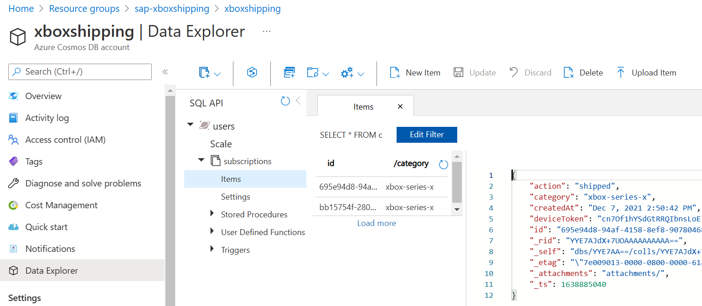
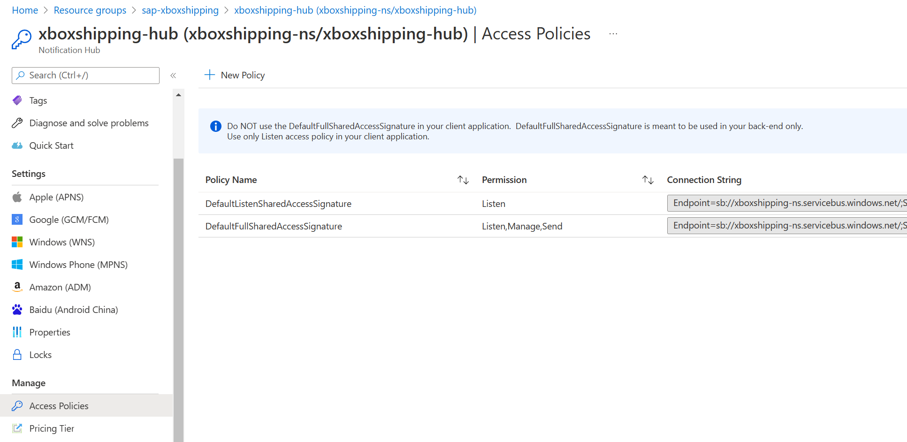
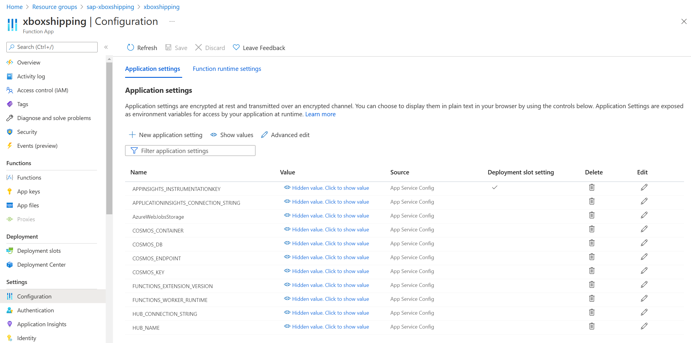

# Convert the SAP message to notifications

The Azure Function App receives the JSON message from the Azure Logic App which reads this message from the topic in the Azure Service Bus. The base of the Function App is an HTTP trigger template. More information on how to create a new Function App based on Python can be found [here](https://docs.microsoft.com/en-us/azure/azure-functions/create-first-function-vs-code-python). The Function App can also be developed in other programming languages but our preferred choice was Python.

## Check the message values

The HTTP trigger template predefines some code that can be used. In this case it will get the JSON object from the HTTP request. The content of our test message looks as follows for the `Goods Receipt` scenario:

```json
{
    "busobj":"BUS2017",
    "busobjname":"Material Document",
    "objkey":"49000047132020",
    "event":"CREATED",
    "date":"2022-01-19",
    "time":"20:11:45",
    "goodsmovementlines":
    [
        {
            "product":"MZ-FG-R100",
            "plant":"1710",
            "storageloc":"171A",
            "quantity":3.000,
            "availQty":313.000,
            "uom":"ST"
        }
    ]
}
```

And for the `Delivery Created` it looks as follows:

```json
{
    "busobj": "LIKP",
    "busobjname": "Outbound Delivery",
    "objkey": "0080002838",
    "event": "CREATED",
    "date": "2021-12-01",
    "time": "09:54:51",
    "shipto": "USCU_L10",
    "loadingdate": "2021-11-15",
    "deliverydate": "2021-11-16",
    "shipmentlines": [
        {
            "product": "MZ-FG-R100",
            "quantity": 5.000,
            "uom": "ST",
            "salesorder": "0000002297"
        },
        {
            "product": "MZ-FG-R100",
            "quantity": 1.000,
            "uom": "ST"
        }
    ]
}
```

The shipmentlines contains the products received. But as you can see one of the products contains a salesorder number and the other doesn't. Therefore let's first check if all the expected values exist before running into unexpected errors.

The start of the code is the same as the HTTP trigger template. First additional activity is to check the values. Let's provide the SAP message and the product we would like to see notifications for. As there are two types of messages, for the sake of the demo a selection for the next step is based on the `busobj` value. The `LIKP` object for the `Create Delivery` scenario and the `BUS2017` object for the `Goods Receipt` scenario.

```py
# Main function where the message is received
def main(req: func.HttpRequest) -> func.HttpResponse:
    logging.info('Python HTTP trigger function processed a request.')

    try:
        status = 400
        logging.info('Read JSON from HTTP body')
        sapmsg = req.get_json()
        logging.info(sapmsg)

        # check the values in the message
        if sapmsg.get('busobj', "") == "LIKP":
            notifybody = checkMessageValuesLIKP(sapmsg, PRD_ID)
        elif sapmsg.get('busobj', "") == "BUS2017":
            notifybody = checkMessageValuesBUS2017(sapmsg, PRD_ID)
        else:
            notifybody = {}
            notifybody['quantity'] = 0.0
```

In the `checkMessageValues` functions the existence of all the list indexes is checked. If the value does not exist it will provide an empty string value. As multiple products with the same ID can exist we add up all the quantities of these products and append the string values for uom (Unit of Measure) and salesorder.

```py
# Check if all the required list items exist in the LIKP message
def checkMessageValuesLIKP(sapmsg, product):
    notifybody = {}
    logging.info("Check if all data is available in sap message")
    notifybody['objkey'] = sapmsg.get('objkey', "")
    notifybody['event'] = sapmsg.get('event', "")
    notifybody['loadingdate'] = sapmsg.get('loadingdate', "")
    notifybody['deliverydate'] = sapmsg.get('deliverydate', "")
    notifybody['product'] = product
    notifybody['quantity'] = 0.0
    notifybody['uom'] = ""
    notifybody['salesorder'] = ""
    shipmentlines = sapmsg.get('shipmentlines',{})
        
    logging.info("Get shipmentlines")
    for shipmentline in shipmentlines:
        logging.info("Check if all data is available in shipmentline")
        shipmentline['product'] = shipmentline.get('product', "")
        logging.info("Check product")
        if shipmentline['product'] == product:
            notifybody['uom'] += shipmentline.get('uom', "") + " "
            notifybody['salesorder'] += shipmentline.get('salesorder', "") + " "
            logging.info("Add quantity: " + str(shipmentline['quantity']))
            notifybody['quantity'] += shipmentline['quantity']

    logging.info("Quantity: " + str(notifybody['quantity']))

    return notifybody
```

And for the `bus2017` value:

```py
# Check if all the required list items exist in the BUS2017 message
def checkMessageValuesBUS2017(sapmsg, product):
    notifybody = {}
    logging.info("Check if all data is available in sap message")
    notifybody['event'] = sapmsg.get('event', "")
    notifybody['date'] = sapmsg.get('date', "")
    notifybody['time'] = sapmsg.get('time', "")
    notifybody['quantity'] = 0.0
    notifybody['availQty'] = 0.0
    goodsmovementlines = sapmsg.get('goodsmovementlines',{})
        
    logging.info("Get goodsmovementlines")
    for goodsmovementline in goodsmovementlines:
        logging.info("Check if all data is available in goodsmovementline")
        goodsmovementline['product'] = goodsmovementline.get('product', "")
        logging.info("Check product")
        if goodsmovementline['product'] == product:
            notifybody['product'] = goodsmovementline.get('product', "")
            notifybody['plant'] = goodsmovementline.get('plant', "")
            notifybody['storageloc'] = goodsmovementline.get('storageloc', "")
            logging.info("Add quantity: " + str(goodsmovementline['quantity']))
            notifybody['quantity'] += goodsmovementline.get('quantity', 0.00)
            notifybody['availQty'] = goodsmovementline.get('availQty', 0.00)
            notifybody['uom'] = goodsmovementline.get('uom', "")

    logging.info("Quantity: " + str(notifybody['quantity']))

    return notifybody
```

All the required JSON values for the notification message are now defined. Next step is to prepare the notification messages.

## Prepare the notifications

Now that we have the JSON values we can prepare the notification message.

```py
# if no relevant procucts for notification found, no need to continue
        if notifybody['quantity'] <= 0.0:
            return func.HttpResponse(
                '{ "msg": "No relevant products found!" }',
                status_code=status
            )

        # prepare the message
        logging.info("Prepare notification message")
        if sapmsg.get('busobj', "") == "LIKP":
            notifymsg = prepareMessageLIKP(notifybody)
        elif sapmsg.get('busobj', "") == "BUS2017":
            notifymsg = prepareMessageBUS2017(notifybody)
        else:
            notifymsg = {}
```

If no Xboxes are found in the SAP message there is no need to continue and a message is returned. The function will receive the output from the `checkMessageValues` functions. This JSON presentation of the message is required by the Azure Notification Hub.

```py
# Prepare the notification message for LIKP
def prepareMessageLIKP(notifybody):
    logging.info("Create message")
    notifymsg = {
        "notification": {
            "title":"Your order is on its way to the store", 
            "body":"We are happy to inform you that your order has been shipped to the store."
        }, 
            "data": {
                "objkey":notifybody['objkey'],
                "status":notifybody['event'],
                "product":notifybody['product'],
                "quantity":notifybody['quantity'],
                "uom":notifybody['uom'],
                "salesorder":notifybody['salesorder']
            }
        }
    
    logging.info(notifymsg)
    return notifymsg
```

And for the `BUS2017` object:

```py
# Prepare the notification message for BUS2017
def prepareMessageBUS2017(notifybody):
    logging.info("Create message")
    notifymsg = {
        "notification": {
            "title":"Material availability changed for product " + notifybody['product'], 
            "body":"The new availability quantity is: " + str(notifybody['availQty'])
        }, 
            "data": {
                "plant":notifybody['plant'],
                "product":notifybody['product'],
                "addedQuantity":notifybody['quantity'],
                "uom":notifybody['uom'],
                "storageloc":notifybody['storageloc']
            }
        }
    
    logging.info(notifymsg)
    return notifymsg
```

## Retrieve premium users

As the idea of the service is that only premium users will receive notification we request only these users who subscribed for this service via the Android App.

```py
# retrieve the device tokens to notify from the Cosmos DB
logging.info("Retrieve device tokens")
items = retrieveDeviceTokens("xbox-series-x")
```

For the storage of the device tokens and categories of interest for the premium subscribers we use an Azure Cosmos DB. The database is called **users** and the container **subscriptions**, as size the smallest is used with 400 shared RU/s.



The data fields defined are `action`, `category`, `createdAt` and `deviceToken`. As partition key the `category` field is used.

We are only interested in retrieving the entries where the category is `xbox-series-x` as this is at the moment the only category premium users can subscribe to.

```py
# Retrieve the device tokens from the Cosmos DB
def retrieveDeviceTokens(category):
    try:
        client = CosmosClient(ENDPOINT, KEY)
        database = client.get_database_client(DATABASE)
        container = database.get_container_client(CONTAINER)
        items = list(container.query_items(query="SELECT * FROM c WHERE c.category = '" + category + "'"))

        return items
    except exceptions.CosmosHttpResponseError as e:
        print( '\nAn error occurred. {0}'.format(e.message))
        return list()
```

The DB credentials are stored seperately to prevent these from being published to the repository. This will be described later.

## Send the notifications

As the preparation steps are completed the notifications can actually be send. Make sure you have the Azure Notification Hub deployed in your subscription as described [here](https://docs.microsoft.com/en-us/azure/notification-hubs/create-notification-hub-portal). The code used for sending the notifications via the Azure Notification Hub can be found [here](https://docs.microsoft.com/en-us/azure/notification-hubs/notification-hubs-python-push-notification-tutorial). The documentation describes all the steps and code used until the moment that the notifications are send to one of the supported platforms, in our case Android.

First a new Azure Notification Hub instance is created with the connection string and hub name which are both defined after deploying the Azure Notification Hub on Azure. You can find the connectiong string under **Access Policies** in the Azure Portal under your Azure Notification Hub deployment.



You will need the one for *Listen,Manage,Send*.

After the Azure Notication Hub instance is created a notification is send to all the device tokens received from the Cosmos DB. The function used is the one for sending messages to Android devices `send_google_notification`.

```py
# create the notification hub
logging.info("Prepare notification")
hub = anh.AzureNotificationHub(APP_NH_CONNECTION_STRING, APP_HUB_NAME, False)

# send the notifications to the relevant devices
logging.info("Send notification to Android devices")
for item in items:
    logging.info("Send to device:" + item.get('deviceToken'))
    status, headers = hub.send_google_notification(True, notifymsg, device_handle=item.get('deviceToken'))

    logging.info("Log the output values")
    if status is not None:
        logging.info("Status: " + str(status))
    else:
        logging.info("No status returned")
```

Finally the status message is returned to the sender of the SAP message to the Function App.

```py
# return the response
logging.info('Send response')
if(status == 400):
    return func.HttpResponse(
        '{ "msg": "No subscribed devices found!" }',
        status_code=status
    )
else: 
    return func.HttpResponse(
        '{ "msg": "Notifications processed" }',
        status_code=status
    )
```

## Credential information

As we would not like our credentials to be published to public repositories these are stored in other files. For local testing of the Function App these are stored in the file `local.settings.json`. In this example this looks like:

```json
{
  "IsEncrypted": false,
  "Values": {
    "AzureWebJobsStorage": "",
    "FUNCTIONS_WORKER_RUNTIME": "python",
    "HUB_NAME": "xboxshipping-hub",
    "HUB_CONNECTION_STRING": "Endpoint=sb://xboxshipping-ns.servicebus.windows.net/;SharedAccessKeyName=DefaultFullSharedAccessSignature;SharedAccessKey=<keyvalue>",
    "COSMOS_ENDPOINT": "https://xboxshipping.documents.azure.com:443/",
    "COSMOS_KEY": "<CosmosDB key>",
    "COSMOS_DB": "users",
    "COSMOS_CONTAINER": "subscriptions"
  }
}
```

Replace the values `<keyvalue>` and `<CosmosDB key>` by the ones from your own subscription.

Once you publish the Function App to Azure the JSON file will not be included. Therefore these parameters need to be defined in your Function App on the Azure Portal. You can do this under **Configuration**.



These are the parameters set in the demo environment. Make sure to set these otherwise the solution will not work.

## Links used in the documentation
[Quickstart: Create a function in Azure with Python using Visual Studio Code](https://docs.microsoft.com/en-us/azure/azure-functions/create-first-function-vs-code-python)\
[Quickstart: Create an Azure notification hub in the Azure portal](https://docs.microsoft.com/en-us/azure/notification-hubs/create-notification-hub-portal)\
[How to use Notification Hubs from Python](https://docs.microsoft.com/en-us/azure/notification-hubs/notification-hubs-python-push-notification-tutorial)